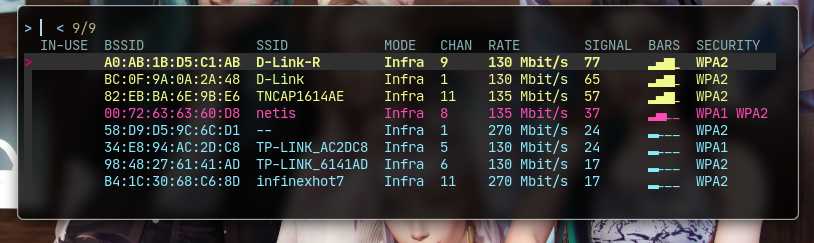
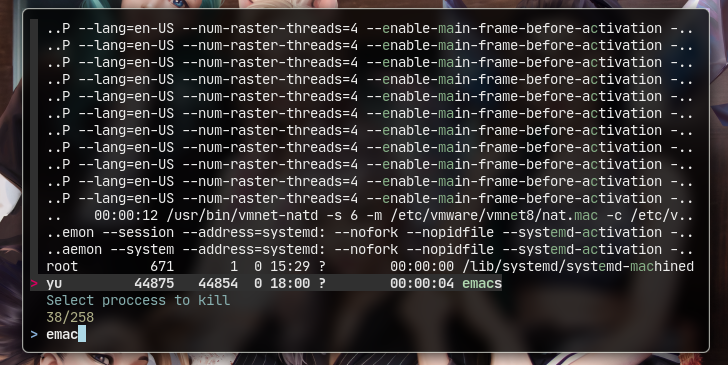
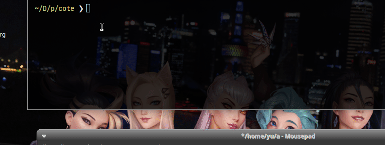

    

      
    

   
  <h1 align="center">
Cool terminal Scripts
</h1>
   

## scripts & ScreenShot

- wifi.sh: script uses fzf & nmcli with a colored interface to connect to wifi networks.

- kp.sh : uses fzf,xargs,ps,kill to generate a bash built task manager that can only kill programs.

- wc.sh : a tool to turn images into text.

- vimv  : a stolen script from https://github.com/thameera/vimv basically bulkrename files the same way ranger does.
